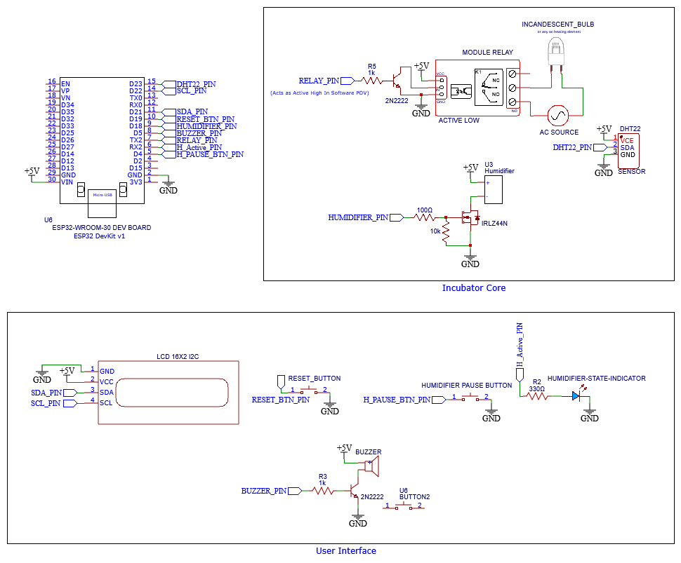

# 🐣 Chicken Eggs Incubator Control System

<div style="display:flex; align-items:center; gap:6px;">
  
  
  
</div>

> Designed and built as a real-world learning challenge: precision control, robust fallback logic, and minimal hardware dependency.

## ⚙️ What It Does

- Controls heating relay and humidifier for ideal hatching conditions
- Displays live data and day count on an I2C LCD
- Automatically adapts targets for early vs. hatching days
- Uses NTP + WiFi for accurate time, but stays safe if WiFi fails
- Config stored in LittleFS — no data loss on power failure
- Buzzer alarm for manual egg turning
- Fully non-blocking loop

## 🔌 System Architecture



- Incubator Core: Relay (heater), humidifier, DHT22 sensor.
- User Interface: LCD, buzzer, buttons (Reset, Hold/Pause Humidifier), Humidifier State LED (Paused or Active).

**Pins:**

| Function                  | ESP32 Pin |
| ------------------------- | --------- |
| DHT22                     | 23        |
| Relay Module (Active Low) | 17        |
| Reset Button              | 19        |
| I2C SDA                   | 21        |
| I2C SCL                   | 22        |
| Buzzer BJT                | 5         |
| Humidifier MOSFET         | 18        |
| Humidifier Pause Button   | 4         |
| Humidifier State LED      | 16        |

**Note:** The relay module is wired as **Active LOW** (BJT level shift for 3.3V logic) — but in the code logic, it’s handled as **Active HIGH** (`HIGH` means heater ON).

## 📡 WiFi Logic — How It Works

- Connects at boot, blocks max 10s
- If connected, syncs NTP time and saves config, then disconnects
- If WiFi drops, non-blocking loop retries every cycle
- `dayLastCheck` only updates if sync succeeds — if sync fails, condition stays true, so retry keeps running
- If fully offline, safe default config keeps control stable

Key benefit: WiFi runs only when needed — saves power, reduces heat, no idle drain

## 🛠️ Sensor Failsafe Logic

This project handles possible DHT22 sensor timeouts by estimating temperature changes based on real-world tests:

- Heat loss: ~0.02 °C per second

- Heat gain (25 W bulb): ~0.01 °C per second

If the sensor fails, the system keeps controlling the heater based on these rates to stay within a safe temperature range until the sensor recovers.

**Important:** These rates depend on your setup — measure your own heat gain/loss values!

_✅ Tip_: A small incandescent bulb is ideal for stable, slow, and easily controllable heating.

Key benefit: This design makes the project more reliable and robust in real conditions.

## ⏸️ Humidifier Pause/Hold Button

The incubator includes a **manual Pause button** (Hold) to temporarily stop the **humidifier** for tasks like:

- Safely turning the eggs by hand
- Refilling or cleaning the water tray
- Doing maintenance inside the incubator

When pressed, the ESP32 disables the humidifier immediately.  
**The user can press again to resume manually**, or — as a safety fallback — the humidifier **automatically resumes** after 5 minutes to ensure the environment stays stable in case you forget to re-enable it.

LED OFF: Default (Humidifier Control ON)

LED OFF: PAUSED (Humidifier Control OFF)

## 🗂️ File Structure

```
/src
  ├── main.cpp
  ├── lcd_manager.cpp
  ├── time_manager.cpp
  ├── wifi_manager.cpp

/include
  ├── lcd_manager.h
  ├── time_manager.h
  ├── wifi_manager.h

/data
  ├── config.json
  ├── wifi.json

platformio.ini
```

ℹ️ **Note:**  
Make sure to **upload the files inside `/data` to the ESP32 flash storage** (LittleFS) using your IDE’s _“Upload File System Image”_ tool.

**`/wifi.json`**

```json
{
  "ssid": "",
  "pwd": ""
}
```

**`/config.json` Sample:**

```json
{
  "incubation_start_date": 1752241510,
  "temperature": {
    "early_days_target": 37.5,
    "early_days_hysteresis": 0.5,
    "hatching_days_target": 37.5,
    "hatching_days_hysteresis": 0.5
  },
  "humidity": {
    "early_days_target": 52.5,
    "early_days_hysteresis": 2.5,
    "hatching_days_target": 67.5,
    "hatching_days_hysteresis": 2.5
  },
  "turning": {
    "last_turn_time": 1752263110,
    "turns_per_day": 4
  },
  "failover": {
    "temp_loss_per_second": 0.02,
    "temp_gain_per_second": 0.01
  }
}
```

[**Default:**](./data/config.json)

```json
{
  "incubation_start_date": 0,
  "temperature": {...},
  "humidity": {...},
  "turning": {
    "last_turn_time": 0,
    "turns_per_day": 3
  },
  "failover": {...}
}
```

- Timestamps use 0 by default — not null — because ArduinoJson handles numbers directly.

## 💨 Ventilation Note

- Add a small fan to circulate air inside — helps keep heat & humidity even.
- Fan runs continuously, no control needed.
- Place sensor near egg level, away from direct fan flow.
- Add small ventilation holes for fresh air — not too big to lose heat fast.

## 🕒 RTC Note

I’m aware that adding a hardware RTC would make the incubator even more reliable. But for version 1, I wanted to challenge myself by handling time synchronization, fallback, and day tracking using only WiFi and NTP.

Version 2 will probably include a dedicated RTC module, additional fail-safe sensors, and maybe even a mechanical egg-turning arm.

## 📚 References

- [Hatching Eggs at Home: A 21-Day Guide for Baby Chicks](https://www.purinamills.com/chicken-feed/education/detail/hatching-eggs-at-home-a-21-day-guide-for-baby-chicks)

## ⚖️ License

This project is licensed under the [MIT License](./LICENSE).
